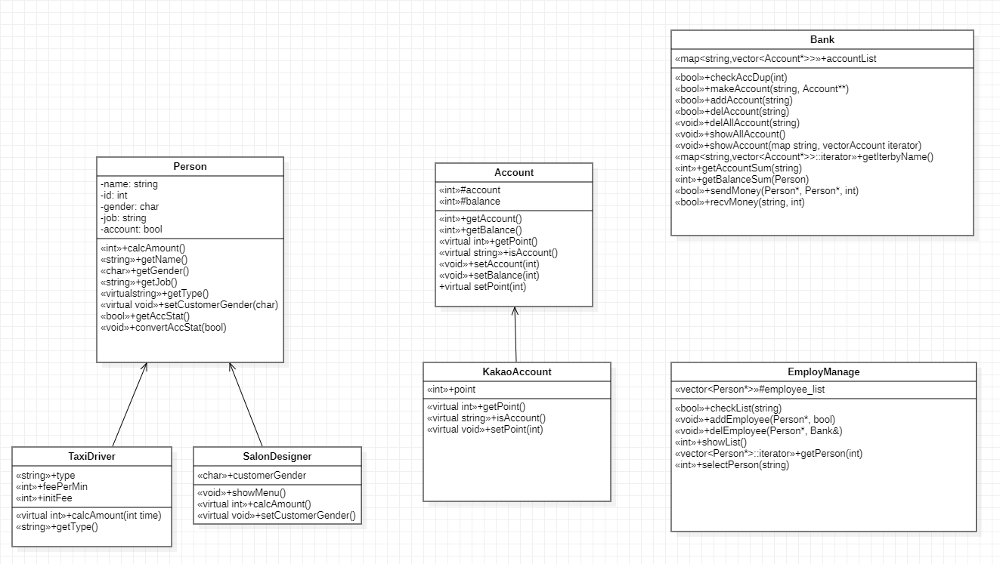

# 경제 활동 프로젝트

## 1. UML

### 1) Person
- 이름, 아이디, 성별, 직업, 계좌보유 여부
- 직업군 : 택시기사, 미용사가 Person 상속
### 2) Bank
- 사람마다 보유하고 있는 계좌들 map(account_list)으로 관리
- 계좌 종류 : 일반 계좌, 카카오뱅크 계좌 (생성시 포인트 적립)
- 계좌 생성/삭제, 잔액 충전, 송금/결제 기능
### 3) Manager
- Person 리스트 관리
- 계정 생성/삭제, 기사/미용사 선택 기능

    

## 2. 메인 페이지

    

## 3. 로그인 페이지

### 1-5) 계좌 관련 기능
### 6-7) 조건에 맞는 활동에 따른 결제 기능
### 7-8) 로그인한 계정 관련 기능